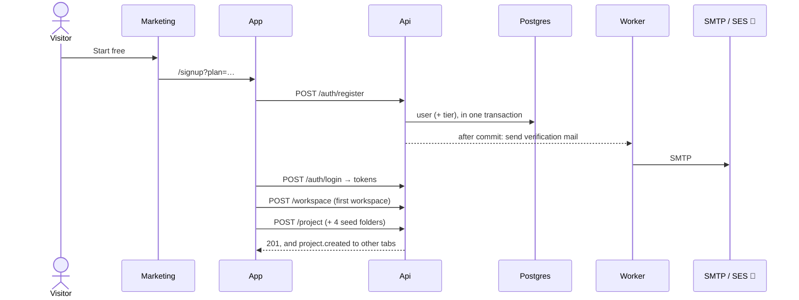
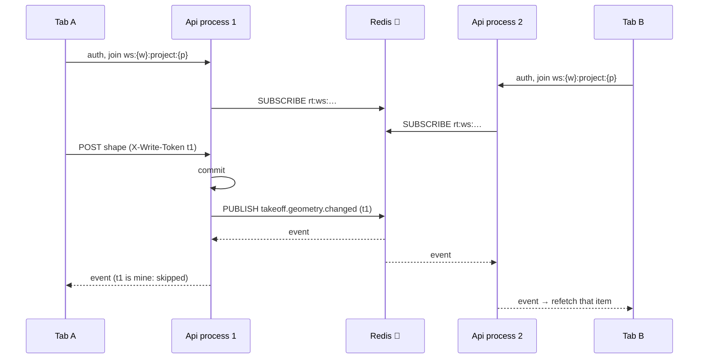
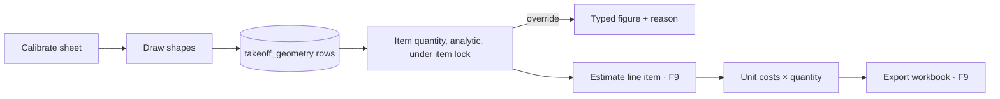
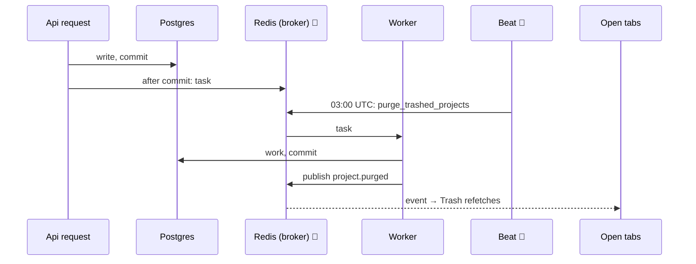
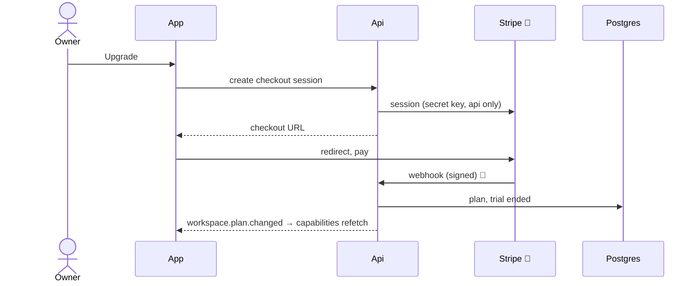

# IntelCost — Cross-system flows

_**Seven journeys that cross the browser, the api, the database, the queue and storage.**
One section each: what the person does, what each part of the system does in turn, and
a diagram. Where a journey is not built yet, the section says which feature builds it
and describes the design that is decided, not a guess._

_Drafted 2026-09-26 (overnight). **Steps marked 🔧 are infrastructure** (Caddy, S3,
Redis, SES, the Lightsail box, Stripe's dashboard): they are Abdullah's under D-11, and
**each wants his review** before this document is treated as true for production._

**Board:** [../MANAGER.md](../MANAGER.md) · **Backlog:** [../FEATURES.md](../FEATURES.md) · **Rules of engagement:** [../DECISIONS.md](../DECISIONS.md)

---

## The parts

| Part | Where | Owns |
|---|---|---|
| Marketing | `intelcost.io`, `intelcost-market-next` | Nothing stateful. Links into the app |
| App | `app.intelcost.io`, `intelcost-app-react` | Screens. Every read and write goes to the api (hard rule 6) |
| Api | `api.intelcost.io`, `intelcost-app-fastapi` | The database, files, money, jobs, and the realtime socket |
| Postgres | Beside the api | Every row. Only the api and its workers touch it |
| Redis | Beside the api | Celery's broker, realtime fan-out, collaboration claims |
| Worker and beat | Celery, same codebase as the api | Mail, purges, file preparation. Beat only schedules |
| S3 | AWS (MinIO on the bench) | Every file. The browser reads and writes it on presigned URLs, never through the api |
| Mail | SES in production (MailHog on the bench) | Verification, reset, invitations, notices |
| Caddy | The Lightsail box | TLS, and the proxy in front of the api and the app |

Two rules shape every flow below:

- **Nothing outside the transaction starts before it commits (D-20).** A mail, a Celery
  task or a realtime event is registered on the session and dispatched after the commit.
  A rollback sends nothing.
- **Bytes never pass through the api.** Uploads and downloads go browser to S3 on
  presigned URLs; the api signs them and records the result (hard rule 5, D-27).

---

## 1. Signup to first project

**Built** (F2, F3, F4).

1. The visitor clicks Start free on marketing and lands on the app's `/signup`, with any
   plan parameters carried in the URL.
2. The app posts `/api/auth/register`. The api refuses a disposable mailbox (D-19),
   resolves the signup tier from the address and the IP (D-18) and records it on the
   user, creates the user, and registers a verification mail. One transaction: a
   failure leaves no row.
3. After the commit the api hands the mail to Celery; the worker sends it through SMTP.
   🔧 **SES in production:** sender identity, DKIM and SPF on `intelcost.io`, and the
   SMTP credentials in the api's and the worker's environment.
4. The app signs in (`/api/auth/login`), stores the token pair and opens the realtime
   socket (flow 3).
5. The dashboard, with no workspace yet, asks for a name and creates one. The workspace
   is stamped with the signup tier and trial length (D-18).
6. New project: two steps, name and details, then an optional drop zone. The api creates
   the project with its four seed folders (Plans, Specs, Reports, Site Photos) and
   publishes `project.created` to everyone else in the workspace.
7. The email link, whenever it is opened, marks the address confirmed. Nothing is gated
   on it (D-07).



---

## 2. Upload to sheet

**Partly built.** Uploading a file into a project is built (F4, D-27). Turning a file
into takeoff sheets is **F5** (D-14, D-27); the bench's temporary Sheets block on
Project Home renders PDFs to PNGs today and F5 retires it.

1. The person drops files onto New project or the file browser. For each file the app
   asks the api to start a multipart upload. The api creates a `ProjectFile` row and an
   S3 multipart upload, and answers with the part size (at least 8 MiB, sized to fit in
   10,000 parts).
2. The app asks for presigned part URLs in batches and PUTs the parts straight to S3,
   retrying a failed part and pausing while offline. 🔧 **S3 CORS** must allow `PUT` from
   `https://app.intelcost.io`.
3. The app asks the api to complete. The api lists the parts S3 holds and completes the
   upload itself, so the browser never needs the `ETag` header. It publishes
   `project.file.changed`.
4. 🔧 **Abandoned uploads.** D-27 says the nightly job aborts any upload still unfinished
   after 24 hours. **That sweep is not built yet** (found 2026-09-26: the nightly job
   aborts only a purged project's open uploads). Until it is, the bucket's
   `AbortIncompleteMultipartUpload` lifecycle rule is the only thing that frees them.
5. **F5.** Perform Takeoff, the first time for a project, opens "Load project files into
   takeoff". The person ticks files, then chooses pages from their thumbnails, and "Load N
   pages" creates a `DrawingFile` per file (pointing back at its `ProjectFile`) and a
   `DrawingSheet` per chosen page.
6. **F5.** A worker prepares each file: large sets are split into per-sheet sources
   (split-source), and thumbnails are rendered server-side. It publishes
   `drawing.source.changed` when a source is ready. 🔧 **The split-source worker's box and
   concurrency** are Abdullah's (D-14).
7. **F5.** The canvas fetches the PDF (or its per-sheet source) from S3 on a presigned
   URL and renders it with pdf.js in the browser at full device resolution. 🔧 **S3 CORS
   and range requests:** pdf.js reads byte ranges, so `GET` with `Range` must be allowed
   and `Accept-Ranges`, `Content-Range` and `Content-Length` exposed.

```mermaid
sequenceDiagram
  actor U as Estimator
  participant A as App
  participant API as Api
  participant S3 as S3 🔧
  participant W as Worker
  U->>A: drop a PDF
  A->>API: start upload
  API->>S3: create multipart upload
  API-->>A: file, part size
  A->>API: part URLs (batch)
  A->>S3: PUT parts (retry, pause offline)
  A->>API: complete
  API->>S3: list parts, complete
  API-->>A: file ready; project.file.changed to others
  Note over U,W: F5 from here
  U->>A: Perform Takeoff → tick files → choose pages → Load N pages
  A->>API: create drawings and sheets
  API-->>W: after commit: split-source, thumbnails
  W->>S3: per-sheet sources, thumbnails
  W-->>A: drawing.source.changed
  A->>S3: GET with Range (pdf.js)
```

---

## 3. Realtime editing

**Built** (F8, D-13, D-20, D-32, D-33).

1. Each tab opens one WebSocket to `wss://api.intelcost.io/api/realtime` and sends its
   access token in the first frame. The api answers `ready` with the person's short name
   ("Sara W.") and colour. 🔧 **Caddy** proxies the upgrade as it is; see the note
   `intelcost-infra/notes/2026-09-26_realtime_caddy_for_abdullah.md` for
   `stream_close_delay`, timeouts, PID 1 and the number of uvicorn processes.
2. The tab joins its workspace's topic, and on a takeoff page its project's topic. Each
   join is checked against membership.
3. A write goes over REST as always, with `X-Write-Token` and `X-Client-Id`. After the
   commit the api publishes an event (uuids and a `kind`) to Redis. 🔧 **Redis** is on the
   request path now.
4. Every api process subscribed to that topic forwards the event to its sockets. Other
   tabs refetch what it names; the writing tab recognises its own token and skips it.
5. While someone draws, `draft` and `cursor` frames go the same way, never stored.
   Other tabs draw the growing shape with a "Sara W." tag (D-33, D-34).
6. In One at a time, the first tab to take an item holds a 15 s Redis claim, renewed by
   its 5 s ping; everyone else's writes to that item are refused 409.
7. A reconnect refetches everything on screen. There is no replay.



---

## 4. Measurement to price

**Partly built.** Measuring is built on today's takeoff page (F1, reshaped by F5 to F7).
Pricing is **F9** (D-09).

1. The estimator calibrates a sheet (two points and a real distance give
   `feet_per_norm`), then draws a line, area or count. Each shape is its own
   `takeoff_geometry` row in normalised coordinates.
2. The api recomputes the item's quantity analytically from all of its shapes, under a
   lock on the item row (D-32), and stores it. The same math lives in
   `src/lib/takeoff` so the canvas shows the number while the pen moves (hard rule 2).
3. An override can replace the quantity with a typed figure and a reason.
4. **F6** adds dimensions and sub-items: a wall's area from its length and height, a
   sub-item derived from its parent.
5. **F9.** The estimate is its own table (D-09): each estimate line item points at a
   takeoff item (or stands alone), carries its own unit costs, and multiplies the
   takeoff quantity through. A takeoff change reaches the open estimate live
   (`estimate.changed`, channel 11).
6. **F9.** Export writes a workbook with live formulas.



---

## 5. Background jobs

**Built** for mail and the nightly purge; file preparation is **F5**; AI and Auto Count
jobs are F13 and F14.

1. A request that needs work done outside itself registers it on the session (D-20).
   After the commit, `outbox.drain` sends it to Celery through Redis. A failed dispatch
   is logged and lost (at-most-once, accepted by D-20).
2. The worker runs the task with its own database session. A task that writes commits
   first and publishes after (`commit_and_drain`), so an open screen hears the result.
3. Beat enqueues scheduled tasks: at 03:00 UTC, `purge_trashed_projects`, which deletes
   projects past their 30 days in Trash (`trash_retention_days`), their S3 objects and
   their open uploads, writing `trash_purge_log` and publishing `project.purged`.
4. 🔧 **Production runs one beat, exactly one**, beside the worker. Two beats would enqueue
   every schedule twice. Not deployed yet (api `STATUS.md`).
5. 🔧 **Worker concurrency and memory** on the 4 GB box, now that renders moved to the
   browser (D-14): Abdullah's call.



---

## 6. Invites

**Built** (F2, F3, D-24).

1. An owner or admin invites an address at a role. The api creates the invitation,
   supersedes any earlier one to that address, registers the invitation mail, and
   publishes `workspace.invitation.changed`. The link is shown once, on the response
   that minted it (D-24).
2. The worker mails it. 🔧 SES as in flow 1.
3. The invitee opens the link. The app previews it without a session: the workspace,
   who invited them, the role, and whether the address already has an account.
4. A new person signs up from the link (the invited address is fixed); an existing one
   signs in. Either way the app accepts the invitation, the api seats them at the role,
   marks the address confirmed, and publishes `workspace.member.changed` (kind
   `joined`). A queued ownership transfer completes in the same transaction.
5. Resend mails a fresh link and kills the old one; re-link hands a new link to the
   admin instead. Both publish `workspace.invitation.changed`.

```mermaid
sequenceDiagram
  actor O as Owner
  participant API as Api
  participant W as Worker
  participant S as SES 🔧
  actor I as Invitee
  participant A as App
  O->>API: POST invitation (role)
  API-->>O: link, once; invitation.changed to admins
  API-->>W: after commit: mail
  W->>S: invitation mail
  S->>I: email
  I->>A: open link → preview (no session)
  I->>A: sign up or sign in
  A->>API: accept
  API-->>A: seated; member.changed (joined) to the workspace
```

---

## 7. Trial to paid

**Not built: F16.** What is decided:

1. At signup the tier and the trial length are resolved once and stamped on the
   workspace (D-18); disposable mailboxes are refused at every tier (D-19).
2. F16 enforces the trial against the workspace: a capability mask while trialling, a
   visible expiry, and `workspace.trial.changed` reaching open tabs live (channel 7).
3. Upgrade goes through Stripe Checkout. The api creates the checkout session (the
   Stripe secret lives only in the api, hard rule 5), the browser is sent to Stripe, and
   Stripe's webhook tells the api the payment happened. The api records the plan and
   publishes `workspace.plan.changed` (channel 6), and the capability mask lifts in every
   open tab.
4. 🔧 **Stripe:** products and prices, the webhook endpoint and its signing secret, and
   the bench's missing fake (infra README, Known gaps).
5. Legacy's `create-checkout-session`, `create-topup-checkout`, `stripe-webhook` and
   `trial-gate` edge functions are the behaviour reference. AI credit top-ups (F14) use
   the same checkout.



---

## For Abdullah to review

Every 🔧 step above, collected:

| Flow | Step | What to confirm |
|---|---|---|
| 1, 6 | SES | Sender identity, DKIM and SPF, SMTP credentials in the api and worker |
| 2 | S3 CORS | `PUT` from the app origin for multipart parts |
| 2 | S3 lifecycle | `AbortIncompleteMultipartUpload` |
| 2 | S3 range reads | `GET` with `Range`, and `Accept-Ranges`, `Content-Range`, `Content-Length` exposed, for pdf.js (F5) |
| 2 | Split-source worker | Where it runs, and its concurrency (D-14) |
| 3 | Caddy, uvicorn, Redis | The realtime note in `intelcost-infra/notes/` |
| 5 | Beat | Exactly one in production |
| 5 | Worker sizing | Concurrency and memory on the 4 GB box after D-14 |
| 7 | Stripe | Products, prices, webhook endpoint and secret, and a bench fake |
